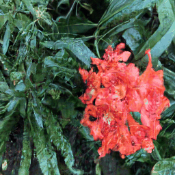

# Denoising Diffusion Models for Plug-and-Play Image Restoration

|Case | Ref Dataset | Diff-PIR Predictions |
|---------|------------------|------------------|
|1|  Synthetic Motion Blurred |  Prediction |
|2|  Synthetic Resolution Blurred |  Prediction |

# Reference
https://github.com/yuanzhi-zhu/DiffPIR
